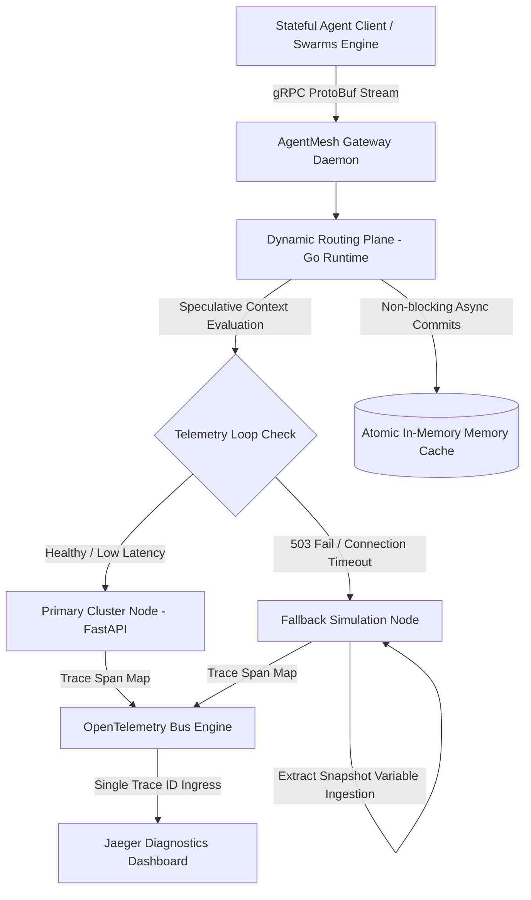

# AgentMesh

[](https://opensource.org)
[](#current-prototype-status)
[](https://go.dev)
[](https://python.org)

**Crash recovery infrastructure for long-running AI agent systems.**

AgentMesh observes distributed runtime execution streams and automatically hot-swaps active agent execution contexts to local fallback instances during upstream network panics or container timeouts. It prevents cascading memory corruption across stateful AI workflows without forcing a complete step-zero processing restart.

---

## 🏛️ Executive Summary & Market Insights

### The Architectural Crisis
Traditional internet infrastructure is fundamentally built for **stateless transactional cycles** (Request/Response). However, autonomous AI agents operate as **stateful, long-running computational processes** that can execute complex reasoning loops spanning minutes or hours. 

When a downstream model framework or vector database experiences an unhandled network timeout or a 503 instance drop mid-execution, standard API gateways perform hard TCP retries or drop the socket connectivity. 

### The Financial & Operational Cost
* **State Wipeout**: Dropping a connection drops the active runtime variables, reasoning history, and temporary execution states.
* **Token Waste**: The application layer is forced to restart the multi-turn process from Step 0, wasting hours of compute progress and inflating token processing budgets.
* **Operational Stall**: Cascading dependency failures lock up thread workers inside distributed microservice clusters.

AgentMesh solves this structural gap by decoupling the tracking of agent memory snapshots from volatile processing environments, introducing an independent crash recovery layer built directly into the low-level proxy framework.

---

## ⚡ The Lifecycle Evolution

### Before AgentMesh (Stateless Infrastructure)
```text
45-Min Operation ──► Upstream Node 503 Panic ──► State Dropped ──► Reprocess Step 0 ($$$ Lost)
```

### With AgentMesh (State-Preserving Runtime)
```text
45-Min Operation ──► Runtime Telemetry Intercept ──► Context Injection ──► Resume Step N
```

---

## 🎯 Target High-Density Workloads

AgentMesh is optimized to stabilize environments running recursive, automated workflows where progress loss implies significant financial or operational penalties:

* **AI Developer Frameworks**: Long-running multi-file file modification and deployment compilation pipelines.
* **Autonomous Research Agents**: Multi-hour deep web scraping, context synthesis, and dynamic data indexing loops.
* **Enterprise Process Workers**: Complex multi-turn multi-provider customer resolution engines handling secure system transactions.

---

## 📡 System Topology Specification

The architecture isolates the core routing daemon from the underlying heavy vector operations data engines to maintain system availability during extreme memory or CPU pressure.



---

## 📉 Structural Matrix: Why Not Existing Solutions?

| Technical Framework | System Paradigm | Why It Fails for Stateful AI Workloads | The AgentMesh Integration Edge |
| :--- | :--- | :--- | :--- |
| **Kubernetes Pod Lifecycle** | Manages hardware allocations and container orchestrations at the OS layer. | Restarts dead containers but possesses zero awareness of internal processing step history or model variables. | Intercepts application logic arrays to preserve variable metadata dumps. |
| **Envoy / API Gateways** | Processes raw TCP network packets and tracks connection constraints. | Incapable of parsing runtime memory configurations or dynamic context token distributions. | Implements context-aware thread multiplexing natively. |
| **Temporal.io** | Orchestrates microservice workflow tracks via complex code retries. | Requires highly invasive framework lock-in directly inside application-level files. | Operates as a decoupled infrastructure proxy layer outside your code repo. |
| **LangGraph / CrewAI** | High-level development engines for prototyping agent loops. | Built as application libraries; cannot control compute capacity limits or network fallbacks. | Acts as a low-overhead proxy layer to manage cluster-level constraints. |
